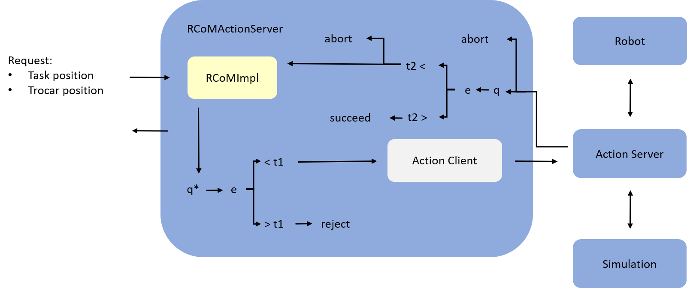

# Remote Center of Motion
Implementation of 'Task Control with Remote Center of Motion Constraint for Minimally Invasive Robotic Surgery' Aghakhani et al. with ROS and Moveit! integration. 

## Overview
Two classes provide functionallity

 - [RCoMImpl](include/rcom_impl/rcom_impl.h), computes joint angle updates under control law presented in paper

 - [RCoMActionServer](include/rcom_impl/rcom_action_server.h), has a [RCoMImpl](include/rcom_impl/rcom_impl.h) and implements a state machine that communicates to ROS via an action client

Overview shown below

 

## Configuration
Configurations in [params.yml](config/params.yml).

 - RCoM computed in between links `link_pi` and `link_pip1`
 - Controls `planning_group`, as defined by Moveit! setup assistant
 - Joint position goals published to action server under `control_client`
